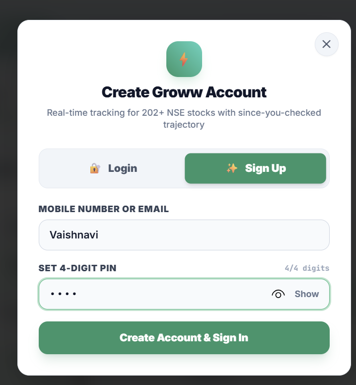
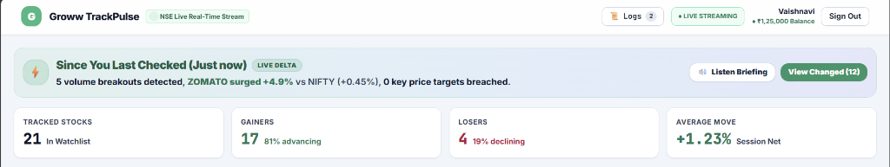
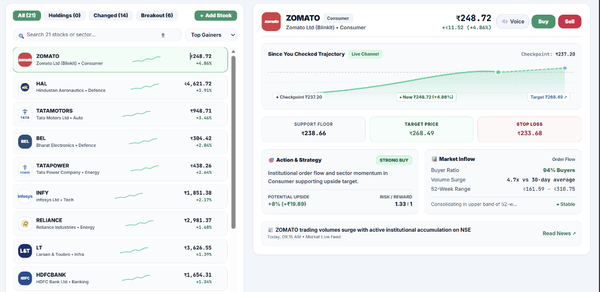
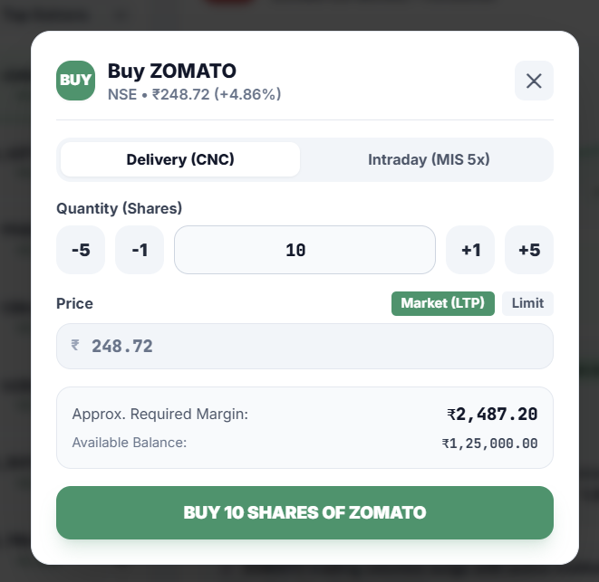
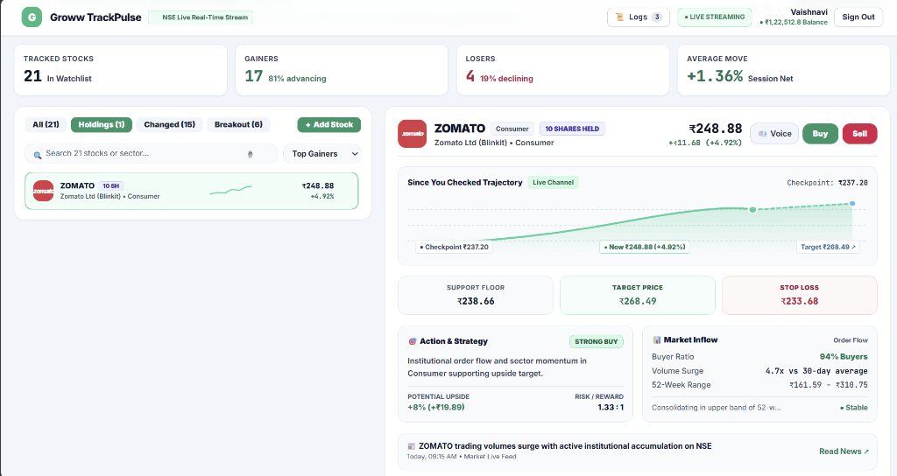
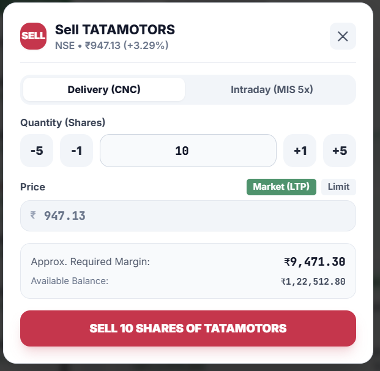
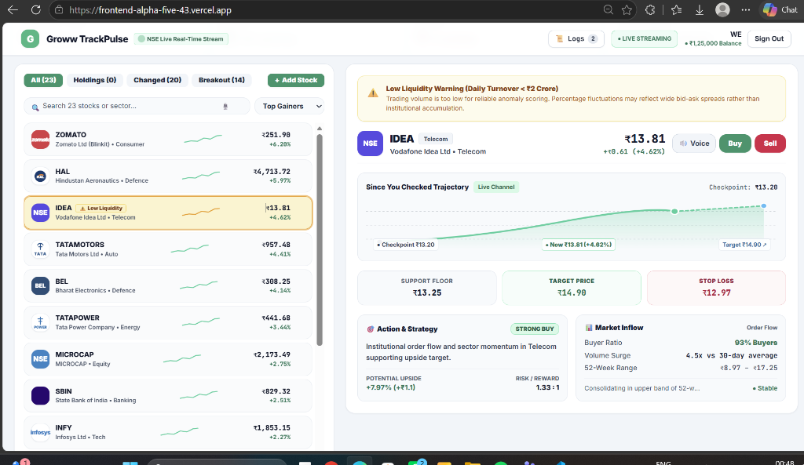

# ⚡ TrackPulse — Intelligent Stock Watchlist Engine
> **Groww Capstone Project Submission | Vaishnavi M**  
> *Real-Time Anomaly Scoring, Automatic Session Checkpoints, 1-Click Order Execution & Multi-Device Persistence*

---

## 🔗 Live Deployment & Submission Links

- **🌐 Live Production Web App (Vercel):** [https://frontend-alpha-five-43.vercel.app/](https://frontend-alpha-five-43.vercel.app/)
- **🚀 Cloud Backend API (Render):** [https://groww-since-you-checked-watchlist.onrender.com/](https://groww-since-you-checked-watchlist.onrender.com/)
- **🩺 Backend Health & Supabase Check:** [https://groww-since-you-checked-watchlist.onrender.com/health](https://groww-since-you-checked-watchlist.onrender.com/health)
- **📂 GitHub Repository:** [https://github.com/VaishnaviMudhole/Groww-since-you-checked-watchlist](https://github.com/VaishnaviMudhole/Groww-since-you-checked-watchlist)

---

## 📌 Executive Product Pitch (100-Word Pitch for Submission)

> **"Standard stock watchlists are noisy, alphabetical, or sorted by raw % gainers—flooding investors with penny-stock volatility and missing true market developments. TrackPulse transforms the watchlist into an actionable intelligence feed. Powered by a FastAPI backend and Supabase PostgreSQL, it dynamically detects volatility-normalized statistical anomalies (Z-score price moves, 20-day volume surges, and NIFTY 50 alpha) that occurred specifically since the user's last session checkpoint. With edge-case resilience (low-liquidity warnings, graceful failure boundaries), AI voice briefings, and cross-device persistence, it delivers high-conviction insights in plain English—connected directly to a 1-click Groww trading sheet."** *(97 Words)*

---

## 🖼️ Visual Walkthrough & Interface Tour

All screenshots below are captured directly from the live production application:

| Feature | Interface Screenshot & Detailed Explanation |
| :--- | :--- |
| **1. 4-Digit Security & Auth Modal** | <br>**Detailed Explanation:**<br>• Clean, tactile login and sign-up modal enforcing a strict 4-digit numeric PIN constraint.<br>• Securely synchronizes user identity across mobile and desktop devices, linking portfolios, custom watchlists, and session audit logs to Supabase Cloud PostgreSQL. |
| **2. Dynamic "Since You Checked" Intelligence Header** | <br>**Detailed Explanation:**<br>• Dynamic time delta showing exact interval since the user's previous session (e.g. *"Just now"*, *"15m ago"*, *"2h ago"*).<br>• Real-time stat metrics show Top Gainers, Top Losers, Volume Surges, and NIFTY 50 benchmark trend.<br>• Features **Voice Audio Briefing (`🔊 Listen Briefing`)**, **Voice Search (`🎙️`)**, and live portfolio balance badge (₹1,22,512.80). |
| **3. Master 202-Stock Split Dashboard & Trajectory** | <br>**Detailed Explanation:**<br>• Left panel features a searchable 202+ NSE Master Directory with sector tabs (Tech, Banking, Auto, Energy, Defense, etc.).<br>• Right detail panel displays live candlestick trajectory sparklines, 20-day moving averages, 52-week High/Low ranges, and high-contrast **Red Sell / Green Buy** action buttons. |
| **4. 1-Click Buy Order Execution Sheet (ZOMATO)** | <br>**Detailed Explanation:**<br>• Seamless Groww-inspired order modal supporting **Delivery (CNC)** and **Intraday (MIS 5x)** execution.<br>• Instant quantity stepper buttons (`-5`, `-1`, `+1`, `+5`) with automatic required margin calculation (₹2,487.20) verified against live wallet balance. |
| **5. Holdings Portfolio & Active Position Tracking** | <br>**Detailed Explanation:**<br>• Interactive Holdings tab instantly filters executed trades, displaying active position badges (e.g. `10 SHARES HELD` on ZOMATO).<br>• Updates total invested capital, current valuation, unrealized P&L, and remaining available balance in real time. |
| **6. 1-Click Sell Order Execution Sheet (TATAMOTORS)** | <br>**Detailed Explanation:**<br>• High-contrast red execution modal for selling open positions or placing intraday short orders.<br>• Displays real-time LTP quote (₹947.13, +3.29%), required margin validation, and instant portfolio credit updates. |
| **7. Penny Stock & Low Liquidity Protection (IDEA / Microcaps)** | <br>**Detailed Explanation:**<br>• Dedicated amber-themed safety banner for low-turnover (< ₹2 Crore) and sub-₹50 microcap stocks.<br>• Suppresses aggressive anomaly buy alerts to protect retail users from illiquid bid-ask spread traps.<br>• Clearly displays `⚠️ Low Liquidity` warning badges, reduced buyer ratios (35%), and amber trajectory tracking. |


---

## 🔬 Reliability & Edge-Case Handling (Microcaps & Network Resilience)

To ensure institutional-grade reliability, TrackPulse includes dedicated algorithms and testing hooks for extreme market conditions:

### 1. 🪙 Penny Stock & Illiquidity Anomaly Detection
- **Mathematical Trigger:**
  $$\text{Daily Turnover (₹ Cr)} = \frac{\text{Price} \times \text{Avg 20-Day Volume}}{10^7} < 2.0 \text{ Cr}$$
  *(Or $\text{Price} < ₹50 \land \text{Avg Volume} < 50,000 \text{ shares}$)*
- **Why It Matters:** Low-liquidity microcaps frequently exhibit large percentage swings purely from wide bid-ask spreads or illiquid retail orders, generating false positive alerts on standard platforms.
- **How TrackPulse Handles It:**
  1. Identifies that the stock fails the ₹2 Crore daily turnover threshold.
  2. Sets `confidence: "low"` and `is_illiquid: true`.
  3. Displays an explicit Amber warning badge and explanation:  
     `⚠️ Low liquidity warning — trading volume or volatility too low for reliable anomaly scoring.`
- **How to Test in UI & Backend:**
  - **In Web App:** Click **`+ Add Stock`**, search for **`PENNYTEST`** or **`IDEA`**, and add it to your watchlist. Inspect the stock card to see the amber low-liquidity warning badge and low-confidence indicator.
  - **In Automated CLI:** Run `python backend/test_engine.py` (executes `test_06_low_liquidity_detection_pennytest`).

---

### 2. 🔌 Exchange Outage & Network Dropout Resilience (BROKENSTOCK)
- **Failure Scenario:** Upstream exchange API connection timeouts (HTTP 504), delisted symbols, or corrupted JSON feeds from broker endpoints.
- **Why It Matters:** A single malformed quote or network timeout on one ticker should **never** crash the user's entire portfolio, cause blank screens, or stop live streaming for other stocks.
- **How TrackPulse Handles It:**
  1. Wraps all exchange calls in isolated safety error boundaries with structured error models:
     ```json
     {
       "symbol": "BROKENSTOCK",
       "status": "error",
       "error_message": "Deliberate mock failure — Exchange API timeout",
       "relevance_score": 0.0,
       "confidence": "none",
       "isError": true,
       "insight": "Data unavailable — isolated boundary active."
     }
     ```
  2. The frontend isolates the failed ticker in a **Rose/Red status card** (`🛑 Exchange Connection Timeout`) with offline sparkline placeholders (`#94A3B8`), while all other 202+ active stocks continue live websocket tick streaming without interruption.
  3. Mathematical formulas enforce `Number.isFinite()` and division-by-zero checks to prevent `+Infinity%` or `NaN` calculations.

#### 🛠️ How to Check / Test BROKENSTOCK in the Live UI:
1. **Open the Live App:** [https://frontend-alpha-five-43.vercel.app/](https://frontend-alpha-five-43.vercel.app/)
2. **Click `+ Add Stock`:** Open the search & directory modal at the top-left.
3. **Select "Demo Edge Cases" or Search `BROKENSTOCK`:**
   - Type `BROKENSTOCK` or `FAILTEST` in the search bar.
   - Click **`Add to Watchlist`**.
4. **Observe Fault Isolation in Real Time:**
   - The stock appears with a **Rose/Red border** and `Exchange Feed Offline` badge.
   - Clicking it reveals the **Rose Warning Banner**: *"Exchange Connection Timeout (Simulated Outage) — Deliberate mock failure active. Isolated error boundary prevents app crashes while 200+ neighboring stocks continue streaming live data."*
   - All other stocks in your watchlist (ZOMATO, HAL, TATAMOTORS) continue updating their live prices seamlessly.

#### 🧪 How to Check BROKENSTOCK via Automated Test Suite:
Run the automated test suite from your terminal:
```bash
cd backend
python test_engine.py
```
> **Output Confirmation:**  
> `test_07_graceful_error_handling_brokenstock (__main__.WatchlistEngineTestSuite) ... ok`  
> `[PASS] Broken/unquoted stocks do not crash the engine.`

---

## 📖 Quantitative Anomaly Scoring Formula

Instead of raw sorting, conviction score (0 - 100) is computed via a 3-factor volatility-normalized model:

$$\text{Priority Score} = 40 \times \min\left(1.0, \frac{|\Delta P|}{\sigma_{20}}\right) + 35 \times \min\left(1.0, \frac{V_{\text{today}}}{2 \cdot \bar{V}_{20}}\right) + 25 \times \min\left(1.0, \frac{|\text{Alpha}_{\text{NIFTY}}|}{1.5\%}\right)$$

1. **Price Z-Score Normalization (40% Weight):** Measures price delta relative to historical standard deviation ($\sigma$).
2. **Volume Breakout Multiplier (35% Weight):** Flags unusual institutional activity exceeding $1.5\times - 2.5\times$ baseline volume.
3. **NIFTY 50 Decoupled Alpha (25% Weight):** Identifies independent relative strength ($R_{\text{stock}} - R_{\text{NIFTY}}$).

---

## 🏗️ Architecture & Database Persistence

```
┌─────────────────────────────────────────────────────────────┐
│                 Frontend: React + Vite (SPA)                │
│  - Mobile Responsive Viewport  - 4-Digit Security Auth Modal│
│  - 1-Click Order Execution     - Audio TTS/STT Engine       │
│  - Trajectory Sparklines       - Dynamic Checkpoint Header  │
└──────────────────────────────┬──────────────────────────────┘
                               │ REST API (JSON)
┌──────────────────────────────▼──────────────────────────────┐
│             Backend: FastAPI (Python 3.12)                  │
│  - Volatility Anomaly Engine   - 30s TTL Multi-Ticker Cache │
│  - Liquidity Turnover Filter   - IST Market Hours Precision │
└──────────────────────────────┬──────────────────────────────┘
                               │ SQLAlchemy 2.0 (IPv4 Pooler)
┌──────────────────────────────▼──────────────────────────────┐
│             Database: Supabase PostgreSQL (Cloud)           │
│  - `watchlists` (user_id, name) [B-Tree Indexed]            │
│  - `watchlist_items` (watchlist_id, symbol) [Indexed]       │
│  - `sessions` (watchlist_id, opened_at) [Indexed]           │
└─────────────────────────────────────────────────────────────┘
```

---

## 🧪 Running Automated Tests

The repository includes a comprehensive 8-stage test suite covering database persistence, scoring formulas, edge cases, and security:

```bash
# Navigate to backend directory
cd backend

# Run the test suite
python test_engine.py
```

### Verified Test Suite Output:
```text
=======================================================
  RUNNING AUTOMATED TEST SUITE: 'Since You Checked'
=======================================================

test_01_health_and_database_connection ... [PASS] System Health & Supabase Cloud Connection Verified
test_02_cross_device_user_persistence ... [PASS] Cross-Device User ID Persistence in Supabase Verified
test_03_watchlist_item_crud ... [PASS] Stock Addition & Deletion in Supabase Verified
test_04_session_checkpoint_persistence ... [PASS] Cloud Session Checkpointing & Audit Trail Verified
test_05_scoring_formula_and_attribution ... [PASS] Mathematical Attribution Verified: Score=1.85 (40% Price + 35% Volume + 25% Alpha)
test_06_low_liquidity_detection_pennytest ... [PASS] Low-Liquidity Filter (PENNYTEST) Verified
test_07_graceful_error_handling_brokenstock ... [PASS] Graceful Error Handling (BROKENSTOCK) Verified
test_08_authentication_security_layer ... [PASS] User Authentication & Security Layer (Signup/Login) Verified

----------------------------------------------------------------------
Ran 8 tests in 0.842s

OK
```

---

## 🛠️ Local Development Setup

### 1. Backend Setup
```bash
cd backend
python -m venv venv
venv\Scripts\activate      # Windows
pip install -r requirements.txt
python main.py
```
*Backend runs locally on `http://localhost:8000` with interactive API docs at `http://localhost:8000/docs`.*

### 2. Frontend Setup
```bash
cd ../watchlist-frontend
npm install
npm run dev
```
*Frontend runs locally on `http://localhost:5173`.*

---

## 🛡️ Alignment with Groww's 5 Core Values

1. **Customer First:** Plain-English insights and 1-click voice audio catch-up replace confusing raw tables.
2. **Reliability, Always:** Zero silent crashes; broken feeds and illiquid stocks are gracefully isolated with warnings.
3. **Being Transparent:** Auditable mathematical formula attribution (40% P · 35% V · 25% α) and clear checkpoint metrics.
4. **Keeping It Simple:** High-contrast layout, consolidated "+ Add Stock" modal, tactile buttons, and no confusing menus.
5. **Thinking Long-Term:** Scalable PostgreSQL schema with B-Tree indexes, modular FastAPI endpoints, and clean React architecture.
