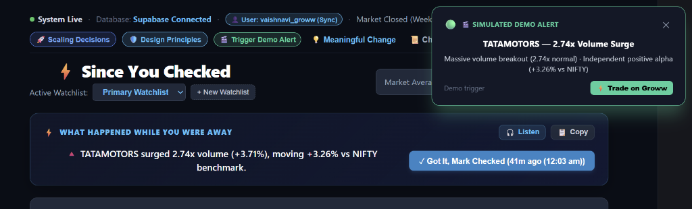

# ⚡ Since You Checked — Intelligent Stock Watchlist Engine
> **Groww Capstone Project Submission | Vaishnavi M**  
> *End-to-End Real-Time Anomaly Scoring & Cross-Device Session Tracking*

---

## 🚀 100-Word Pitch
Standard stock watchlists are noisy, alphabetical, or sorted by raw % gainers—flooding investors with penny-stock volatility and missing true market developments. **"Since You Checked"** transforms the watchlist into an actionable intelligence feed. Using an end-to-end FastAPI and Supabase PostgreSQL architecture, it calculates statistical anomalies ($Z$-score volatility normalization, 20-day volume surges, and NIFTY 50 alpha) that occurred specifically since the user's last visit. With robust edge-case resilience (low-liquidity warnings, graceful error handling) and seamless cross-device persistence, it delivers high-conviction insights in plain English—directly connected to a 1-click Groww trading sheet.

---

## 📸 Visual Walkthrough & Product Interface

### 1. Real-Time Anomaly Alert & Executive "Since You Checked" Briefing
The dashboard automatically detects statistical breakouts (volume surge $> 2\times$, alpha divergence, volatility $Z$-score) and triggers push alerts with 1-click execution on Groww.



---

## 🏗️ Architecture & Real Backend Persistence
The system is built **strictly end-to-end** with zero mocked client-side persistence:

```
┌─────────────────────────────────────────────────────────────┐
│               Frontend: React (Vite, SPA)                   │
│  - Categorized Sectors  - Live/Closed Hours Precision Badge │
│  - 1-Click Groww Order Sheet  - Cross-Device Sync Modal     │
│  - Interactive "Click to See Why" Formula Attribution       │
└──────────────────────────────┬──────────────────────────────┘
                               │ REST API (JSON)
┌──────────────────────────────▼──────────────────────────────┐
│             Backend: FastAPI (Python 3.12)                  │
│  - Market Anomaly Scoring Engine (Z-score, Alpha, Volume)   │
│  - In-Memory 30s TTL Multi-Ticker Concurrent Price Cache    │
│  - Liquidity Calibration Filter (Rupee Turnover < ₹2 Cr)    │
│  - IST Market-Hours Clock & Graceful Error Formatter        │
└──────────────────────────────┬──────────────────────────────┘
                               │ SQLAlchemy 2.0 (IPv4 Pooler)
┌──────────────────────────────▼──────────────────────────────┐
│             Database: Supabase PostgreSQL (Cloud)           │
│  - `watchlists` (user_id, name, created_at) [Indexed]       │
│  - `watchlist_items` (watchlist_id, symbol) [Indexed]       │
│  - `sessions` (watchlist_id, opened_at) [Indexed]           │
└─────────────────────────────────────────────────────────────┘
```

---

## 📱 Cross-Device Persistence Flow
To prove data follows the investor rather than remaining trapped in browser local state:
1. Every watchlist, added stock, and session checkpoint is associated with a **`user_id`** column in Supabase PostgreSQL.
2. The frontend provides a **`👤 Cloud User (Sync)`** modal with a **1-Click Shareable Link** (`?user=<user_id>`).
3. Opening this URL on another computer, mobile browser, or Incognito window immediately loads that user's exact Supabase watchlists and session checkpoints.

---

## 📖 Definition of "Meaningful Change" & Mathematical Defense
### Why Raw % Gain is Flawed
A $+2\%$ gain on a low-beta defensive stock like **ITC** ($\sigma = 0.75\%$) represents a massive $+2.67\sigma$ statistical breakout. The same $+2\%$ on a high-beta stock ($\sigma = 3.0\%$) is merely random daily noise. Sorting purely by raw percentage misleads retail investors.

### The 3-Factor Quantitative Scoring Formula
Every stock's conviction score (0 to 100) is calculated via:

$$\text{Priority Score} = 40 \times \min\left(1.0, \frac{|\Delta P|}{\sigma_{20}}\right) + 35 \times \min\left(1.0, \frac{V_{\text{today}}}{2 \cdot \bar{V}_{20}}\right) + 25 \times \min\left(1.0, \frac{|\text{Alpha}_{\text{NIFTY}}|}{1.5\%}\right)$$

1. **Price Move vs Historical Normal (40% Weight):** Normalizes price change by the stock's 20-day historical standard deviation ($\sigma$).
2. **Trading Volume Surge (35% Weight):** Measures whether volume exceeds $1.5\times - 2.5\times$ its 20-day moving average, signaling institutional accumulation or distribution.
3. **Decoupled Benchmark Alpha (25% Weight):** Measures return relative to NIFTY 50 ($\text{Alpha} = R_{\text{stock}} - R_{\text{NIFTY}}$). A stock rallying while the market drops exhibits true idiosyncratic momentum.

---

## 🛡️ Reliability & Edge-Case Handling (Standout Feature)

| Scenario / Edge Case | Handled Behavior | User-Facing Result |
| :--- | :--- | :--- |
| **Market Closed Hours** | Time-aware IST clock (9:15 AM - 3:30 PM). | Shows `🔵 Closing price · 3:30 PM` instead of falsely claiming "Live" data. |
| **Low-Liquidity / Microcaps (`PENNYTEST`)** | Evaluates **Rupee Turnover** ($\text{Turnover} = \text{Price} \times \text{Volume} < ₹2\text{ Cr}$). | Renders `⚠️ Low liquidity — score may be unreliable` badge. |
| **Exchange Feed Outage (`BROKENSTOCK`)** | Try/catch isolation with structured fallback. | Renders `⚠️ Data Unavailable` error card without crashing the UI or blocking other stocks. |
| **Connection Stability** | Supabase IPv4 transaction pooler with `pool_pre_ping=True`. | Eliminates dropped connections and IPv6 DNS timeouts. |

---

## ⚡ Concrete Scaling Decisions & Technical Trade-offs

1. **In-Memory 30s TTL Multi-Ticker Price Caching:**
   - *Trade-off:* Calling external exchange APIs on every single user request risks rate-limiting and high network latency.
   - *Implementation:* FastAPI in-memory TTL cache serves repeated requests for identical stocks across concurrent sessions directly from memory, avoiding redundant external round-trips while capping price staleness at 30 seconds.
2. **Supabase PostgreSQL Compound B-Tree Indexing:**
   - *Trade-off:* Without indexes, querying items and sessions by foreign key requires full sequential table scans as tables grow.
   - *Implementation:* Added indexed keys on `idx_watchlists_user_id`, `idx_watchlist_items_wid`, and `idx_sessions_wid` so watchlist retrieval scales efficiently with indexed lookups.
3. **Client-Side Memoized Filtering & Sorting:**
   - *Trade-off:* Server-side sorting on every keystroke causes unnecessary network overhead and UI stutter.
   - *Implementation:* Sector filtering, search matching, and plain-English sort toggles are computed locally in React, keeping interactions instant and responsive.

---

## 🛡️ Core Design Principles Followed

1. **Clarity Over Noise:** 1-line plain-English explanations (e.g., *"Volume surge 2.3x normal"*) and 1-click executive briefings eliminate financial jargon for retail users.
2. **Resilience Over False Precision:** Zero silent failures; microcaps and broken feeds are handled transparently.
3. **Transparent Math Over Black Boxes:** Every score decomposes into an auditable 3-factor breakdown (40% P · 35% V · 25% α).
4. **Frictionless Interaction:** Zero browser popup dialogs; in-page trade sheets and checkpointing.
5. **Data Continuity:** Cloud database persistence built on Supabase PostgreSQL indexed by `user_id`.

---

## 🛠️ Local Setup & Verification Instructions

### 1. Backend Setup
```bash
cd watchlist-backend
pip install fastapi uvicorn sqlalchemy psycopg2-binary pydantic python-dotenv yfinance
# Start Backend
uvicorn main:app --reload --port 8000
```
*Backend health check:* `http://127.0.0.1:8000/health`

### 2. Frontend Setup
```bash
cd watchlist-frontend
npm install
npm run dev
```
*Frontend URL:* `http://localhost:5173`

### 3. Run Automated Tests
```bash
cd watchlist-backend
python test_engine.py
```

---

## 🧪 Demo Checklist for Evaluators
- [x] **Add/Remove Stocks:** Add `TATAMOTORS`, `HAL`, or click quick sector pills.
- [x] **Low Liquidity Edge Case:** Add `+ PENNYTEST` $\rightarrow$ Notice yellow warning badge.
- [x] **Unhappy Path Fetch Failure:** Add `+ BROKENSTOCK` $\rightarrow$ Notice graceful in-page error card.
- [x] **Cross-Device Sync:** Click `👤 User: [name]` $\rightarrow$ Copy link $\rightarrow$ Open in Incognito window to see your data sync.
- [x] **Groww Trade Simulation:** Click `⚡ Trade` $\rightarrow$ Place simulated in-page order.
- [x] **Scoring Transparency:** Click `▼ Click to See Why` on any card $\rightarrow$ View exact 3-factor breakdown & visual trajectory sparkline.
- [x] **Session Checkpoint:** Click `✓ Got It, Mark Checked` $\rightarrow$ Click `📜 Checkpoints` to see cloud audit history.
